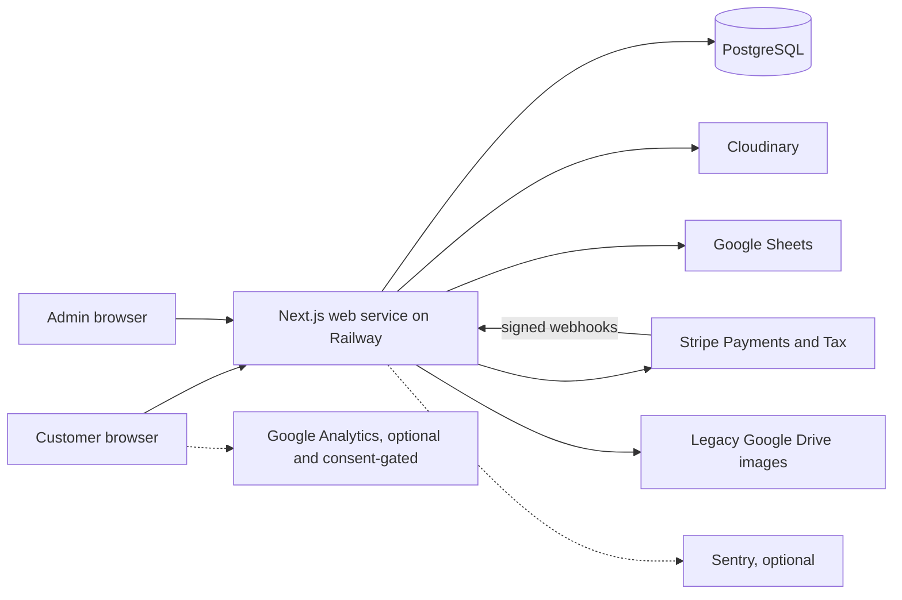

# System architecture

**Status:** deployed base plus reviewed release candidate

**Last verified:** September 10, 2026

## Context

Friesian Ranchwear is a modular monolith. One Next.js application serves the public storefront, customer account, admin interface, API routes, and Stripe webhooks. Railway runs one web service connected to one PostgreSQL service. There is no separate worker, scheduler, queue, or internal API.

The deployed production service remains Git commit `1282322c62c5e04bf474fd7a832c4383a4fa696d`. The payment-integrity implementation described below is a reviewed release candidate, not yet deployed. Production database and provider state therefore remain the authority when deciding whether a behavior is active.



## Deployment model

| Concern | Deployed production | Reviewed candidate |
| --- | --- | --- |
| Git source | `main` at `1282322...` | Isolated review branch and pull request |
| Node runtime | Node 20 in the active Railway deployment | Node 24 in CI, Nixpacks, `.nvmrc`, and package engines |
| Database history | Legacy schema with no `_prisma_migrations` table | Checked-in `0_init` baseline plus additive `20260910120000_payment_integrity` migration |
| Migration execution | No automatic migration | Still no automatic migration; separately approved migration-before-app release |
| Payment hardening | Legacy behavior | Durable checkout attempts, event ledger, payment projection, and financial operations |

- GitHub `main` is the release branch and Railway's production service is linked to it.
- `npm run build` generates the Prisma client and builds Next.js.
- Railway starts the application with `npm run start`; startup never applies migrations.
- `/api/health` performs `SELECT 1`; Railway uses it as the deployment health check.
- The web process handles pages, APIs, opportunistic cleanup, and webhooks.
- PostgreSQL and all external providers are production dependencies. There is no degraded read-only mode.

The production schema was exported read-only and restored into isolated local PostgreSQL 17. It matched the exact baseline, the additive migration applied successfully, all table counts were preserved, and core integrity checks remained zero. That proves the logical export and migration path; it does not prove Railway snapshot/PITR recovery, production RTO, or provider payment truth. Production migration remains a separately approved release step that must complete before the matching application deployment.

## Code map

| Path | Responsibility |
| --- | --- |
| `app/` | App Router pages, layouts, CSS modules, and HTTP route handlers |
| `app/components/` | Storefront and account UI components |
| `components/` | Root providers, cart drawer, consent, analytics, and error boundary |
| `lib/` | Prisma, auth, Stripe, cart state, image storage, rate limiting, and small domain helpers |
| `lib/order-lifecycle.js` | Injected database transactions for reservation and payment-state projection |
| `prisma/schema.prisma` | Relational data model |
| `tests/unit/` | Vitest tests for isolated helpers |
| `tests/integration/` | PostgreSQL-backed order and inventory transaction tests |
| `tests/e2e/` | Playwright browser and shallow API checks |
| `docs/` | Tracked engineering documentation |
| `.interface-design/` | Compatibility pointer for older design tooling |

The split between `app/components/` and top-level `components/` is historical, not a formal architectural boundary. New global providers belong at the top level. Route-specific or domain UI belongs near `app/`.

## HTTP surface

| Route | Methods | Access | Responsibility |
| --- | --- | --- | --- |
| `/api/account/orders` | GET | Signed-in user | Current user's order history |
| `/api/admin/emails` | GET | Admin | Mailing-list view |
| `/api/admin/orders` | GET | Admin | Order list and stale reservation cleanup |
| `/api/admin/orders/[id]` | GET, PUT | Admin | Order detail and manual display status |
| `/api/admin/products` | GET, POST | Admin | Product list and creation |
| `/api/admin/products/[id]` | GET, PUT, DELETE | Admin | Product editing and guarded deletion |
| `/api/admin/reviews` | GET | Admin | Review moderation list |
| `/api/admin/reviews/[id]` | GET, PATCH, DELETE | Admin | Review moderation actions |
| `/api/admin/upload` | POST, DELETE | Admin | Cloudinary image lifecycle |
| `/api/auth/[...nextauth]` | GET, POST | Public | NextAuth protocol |
| `/api/auth/signup` | POST | Public | Credentials account creation |
| `/api/checkout` | POST | Public or signed in | Tax, PaymentIntent, stock reservation, order creation |
| `/api/health` | GET | Public | Database-backed liveness check |
| `/api/image` | GET | Public | Legacy Google Drive image proxy |
| `/api/orders/lookup` | POST | Account owner | Signed-in order history scoped by immutable user ID |
| `/api/orders/verify` | POST | Account owner or guest capability | Checkout success verification |
| `/api/products` | GET | Public | Active catalog and product detail payloads |
| `/api/products/[id]/reviews` | GET, POST | Public read, signed-in write | Approved reviews and verified-purchase submission |
| `/api/subscribe` | POST | Public | Google Sheets mailing-list subscription |
| `/api/webhooks/stripe` | POST | Stripe signature | Financial event synchronization |

## Catalog flow

1. The browser requests `/api/products`.
2. The route reads active products, variants, and images through Prisma.
3. The route converts Prisma decimals and stored JSON features into the client payload.
4. The browser selects a specific variant and stores a cart projection in `localStorage`.
5. Cart price, image, and availability are display hints only. Checkout re-reads price, active status, variant identity, and stock from PostgreSQL.

## Checkout and inventory flow

```mermaid
sequenceDiagram
    participant Browser
    participant Checkout as POST /api/checkout
    participant DB as PostgreSQL
    participant Tax as Stripe Tax
    participant Stripe as Stripe PaymentIntent
    participant Hook as Stripe webhook

    Browser->>Browser: persist UUID key + canonical payload hash
    Browser->>Checkout: key, variant IDs, quantities, contact, shipping
    Checkout->>DB: create or lease matching CheckoutAttempt
    Checkout->>DB: load current variants and prices
    Checkout->>Tax: calculate tax from server totals and address
    Checkout->>DB: persist TAX_READY attempt and tax snapshot
    Checkout->>DB: transaction: CAS stock decrement + PENDING order
    Checkout->>Stripe: create/reuse PaymentIntent with stable idempotency key
    Checkout->>DB: fenced link; mark attempt READY
    Checkout-->>Browser: client secret, order ID, authoritative totals
    Browser->>Browser: store 30-day single-order guest capability
    Browser->>Stripe: confirm payment with Payment Element
    Stripe-->>Hook: payment_intent.succeeded
    Hook->>DB: persist/lease StripeEvent
    Hook->>DB: verify amount/currency; project payment PAID
    Hook->>DB: enqueue durable Tax commit
    Hook->>Tax: create/replay Tax Transaction
    Hook->>DB: fence operation and event completion
    Browser->>DB: verify owned/capability-scoped order status
```

Failure behavior:

- If tax calculation fails, no order or PaymentIntent is created.
- Stock reservation and order creation happen before the PaymentIntent provider call.
- If the provider call succeeds but local linking fails, the attempt remains resumable with the same Stripe idempotency key; the application does not blindly cancel an uncertain intent.
- A failed payment attempt leaves the `PENDING` order reserved because Stripe can retry the same PaymentIntent.
- A canceled PaymentIntent cancels only a `PENDING` order and restores stock once.
- Cleanup inspects stale `PENDING` orders, checks Stripe state, and only releases inventory after a safe cancellation result.
- Cleanup is opportunistic. It runs during checkout and admin order listing, not on a schedule.

## Payment authority

Stripe is the source of financial events. PostgreSQL stores the operational projection used by the storefront and admin.

The webhook currently handles:

- `payment_intent.succeeded`
- `payment_intent.payment_failed`
- `payment_intent.canceled`
- `charge.refunded` for partial and full refunds

Every signed event ID is persisted with a lease and retry state before local projection.
Payment amount/currency and refund totals are projected separately from fulfillment.
Tax commits and partial flat-amount reversals are durable fenced operations. Provider
replay stops before Stripe's idempotency retention boundary and becomes a manual
reconciliation case. Admins can move only verified-paid orders through
`PAID -> PROCESSING -> SHIPPED -> DELIVERED`, and every transition records the current
database-authorized actor and reason in the same transaction.

Admin product editing uses a full variant snapshot hash plus per-row stock and
`updatedAt` compare-and-swap checks. A stale metadata edit rolls back rather than
overwriting inventory changed by a concurrent checkout.

## Authentication and authorization

- Credentials are stored as bcrypt hashes.
- NextAuth uses JWT sessions.
- Client layouts redirect unauthenticated users for experience only.
- Every protected API route independently checks the server session.
- Admin JWTs are revalidated against the database while they contain admin access, so demotion takes effect without waiting for token expiry.
- The repeated admin guard is not centralized, which increases drift risk.

## External adapters

### Stripe

Used for tax calculation, PaymentIntent creation and confirmation, cancellation, and webhook verification. Checkout depends on Stripe even before card entry because tax is calculated server-side.

### Cloudinary

The admin uploads images directly through an authenticated application route. Deleting a saved image occurs after the product database update succeeds. Unsaved uploads are deleted only when the admin explicitly removes them, so abandoned edits can leave orphaned provider assets.

### Google Sheets

Mailing-list state lives outside PostgreSQL. Subscription checks read the sheet before append. This is simple but introduces latency, weak concurrency behavior, and a second operational data store.

### Google Drive

Legacy product image URLs are converted or proxied. The target state is Cloudinary-only product media, after which `/api/image` and Drive conversion code can be retired.

### Sentry and Google Analytics

Both are optional. Analytics loads only after local consent. Sentry code initializes when
DSNs are configured, sends no default PII, disables replay, and scrubs request bodies,
credentials, capabilities, client secrets, referrers, and breadcrumbs.

## Architectural strengths

- A single deployable is appropriate for the current traffic and team size.
- Server-side price and stock authority is explicit.
- Stock decrement and order creation are transactional.
- Payment cancellation and cleanup paths protect against double restocking without treating a retryable failed attempt as terminal.
- Every admin write route performs server-side authorization.
- Image-provider details are partly isolated behind focused helpers.
- Production health includes the database rather than checking only the homepage.

## Boundary debt

- Product editing still contains substantial domain orchestration directly.
- Prisma is called from most route handlers, so business behavior is hard to test without module mocking.
- Request validation is handwritten and inconsistent.
- Rate limiting is process-local and does not coordinate across replicas or restarts.
- There is no worker or scheduler for expired reservations.
- Rate-limited guest recovery is limited to a 30-day, same-browser single-order capability;
  verified other-device recovery requires a future transactional-email channel.
- The legacy fulfillment enum remains for compatibility, while `paymentStatus` is the
  financial authority during the expand phase.
- Large client components combine networking, state machines, validation, and presentation.

The preferred evolution is incremental extraction. `lib/order-lifecycle.js` is the first example: routes retain HTTP and provider concerns while injected database operations can run against PostgreSQL in integration tests. Continue this pattern for payment, product, and authorization rules without starting a framework or directory rewrite.
