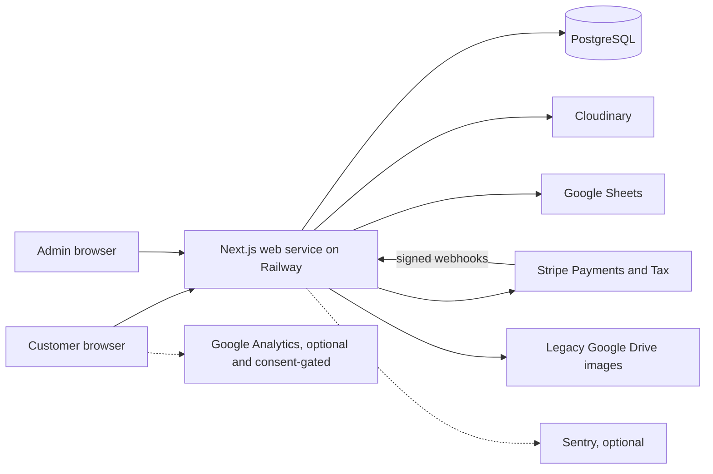
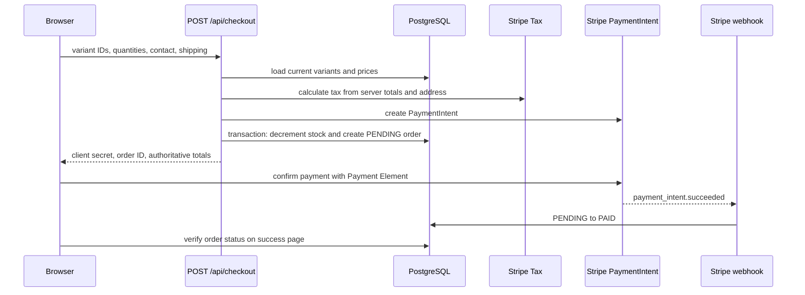

# System architecture

**Status:** current-state model

**Last verified:** July 15, 2026

## Context

Friesian Ranchwear is a modular monolith. One Next.js application serves the public storefront, customer account, admin interface, API routes, and Stripe webhooks. Railway runs one web service connected to one PostgreSQL service. There is no separate worker, scheduler, queue, or internal API.

## Deployment model

- GitHub `main` is the release branch.
- Railway builds with Node 20 and `npm ci`.
- `npm run build` generates the Prisma client and builds Next.js.
- Railway starts the application with `npm run start`.
- `/api/health` performs `SELECT 1`; Railway uses it as the deployment health check.
- The web process handles pages, APIs, cleanup work, and webhooks.
- PostgreSQL and all external providers are production dependencies. There is no degraded read-only mode.

The repository currently has no database migration history and the deploy does not apply migrations. Schema changes are blocked until a baseline is established.

## Code map

| Path | Responsibility |
| --- | --- |
| `app/` | App Router pages, layouts, CSS modules, and HTTP route handlers |
| `app/components/` | Storefront and account UI components |
| `components/` | Root providers, cart drawer, consent, analytics, and error boundary |
| `lib/` | Prisma, auth, Stripe, cart state, image storage, rate limiting, and small domain helpers |
| `prisma/schema.prisma` | Relational data model |
| `tests/unit/` | Vitest tests for isolated helpers |
| `tests/e2e/` | Playwright browser and shallow API checks |
| `docs/` | Tracked engineering documentation |
| `.interface-design/` | Compatibility pointer for older design tooling |

The split between `app/components/` and top-level `components/` is historical, not a formal architectural boundary. New global providers belong at the top level. Route-specific or domain UI belongs near `app/`.

## HTTP surface

| Route | Methods | Access | Responsibility |
| --- | --- | --- | --- |
| `/api/account/orders` | GET | Signed-in user | Current user's order history |
| `/api/admin/emails` | GET | Admin | Mailing-list view |
| `/api/admin/orders` | GET | Admin | Order list and stale reservation cleanup |
| `/api/admin/orders/[id]` | GET, PUT | Admin | Order detail and manual display status |
| `/api/admin/products` | GET, POST | Admin | Product list and creation |
| `/api/admin/products/[id]` | GET, PUT, DELETE | Admin | Product editing and guarded deletion |
| `/api/admin/reviews` | GET | Admin | Review moderation list |
| `/api/admin/reviews/[id]` | GET, PATCH, DELETE | Admin | Review moderation actions |
| `/api/admin/upload` | POST, DELETE | Admin | Cloudinary image lifecycle |
| `/api/auth/[...nextauth]` | GET, POST | Public | NextAuth protocol |
| `/api/auth/signup` | POST | Public | Credentials account creation |
| `/api/checkout` | POST | Public or signed in | Tax, PaymentIntent, stock reservation, order creation |
| `/api/health` | GET | Public | Database-backed liveness check |
| `/api/image` | GET | Public | Legacy Google Drive image proxy |
| `/api/orders/lookup` | POST | Public | Email-based guest order history |
| `/api/orders/verify` | POST | Public | Checkout success verification |
| `/api/products` | GET | Public | Active catalog and product detail payloads |
| `/api/products/[id]/reviews` | GET, POST | Public read, signed-in write | Approved reviews and verified-purchase submission |
| `/api/subscribe` | POST | Public | Google Sheets mailing-list subscription |
| `/api/webhooks/stripe` | POST | Stripe signature | Financial event synchronization |

## Catalog flow

1. The browser requests `/api/products`.
2. The route reads active products, variants, and images through Prisma.
3. The route converts Prisma decimals and stored JSON features into the client payload.
4. The browser selects a specific variant and stores a cart projection in `localStorage`.
5. Cart price, image, and availability are display hints only. Checkout re-reads price, active status, variant identity, and stock from PostgreSQL.

## Checkout and inventory flow

Failure behavior:

- If tax calculation fails, no order or PaymentIntent is created.
- If stock reservation or order creation fails after PaymentIntent creation, the handler attempts to cancel the PaymentIntent.
- Failed or canceled payment webhooks cancel only `PENDING` orders and restore stock once.
- Cleanup inspects stale `PENDING` orders, checks Stripe state, and only releases inventory after a safe cancellation result.
- Cleanup is opportunistic. It runs during checkout and admin order listing, not on a schedule.

## Payment authority

Stripe is the source of financial events. PostgreSQL stores the operational projection used by the storefront and admin.

The webhook currently handles:

- `payment_intent.succeeded`
- `payment_intent.payment_failed`
- `payment_intent.canceled`
- `charge.refunded` for full refunds

Webhook writes are mostly state-idempotent, but webhook event IDs are not persisted. The admin can also change `PAID`, `CANCELLED`, or `REFUNDED` display status without performing a Stripe action. The UI warns about this, but the model does not yet separate financial state from fulfillment state.

## Authentication and authorization

- Credentials are stored as bcrypt hashes.
- NextAuth uses JWT sessions.
- Client layouts redirect unauthenticated users for experience only.
- Every protected API route independently checks the server session.
- Admin JWTs are revalidated against the database while they contain admin access, so demotion takes effect without waiting for token expiry.
- The repeated admin guard is not centralized, which increases drift risk.

## External adapters

### Stripe

Used for tax calculation, PaymentIntent creation and confirmation, cancellation, and webhook verification. Checkout depends on Stripe even before card entry because tax is calculated server-side.

### Cloudinary

The admin uploads images directly through an authenticated application route. Deleting a saved image occurs after the product database update succeeds. Unsaved uploads are deleted only when the admin explicitly removes them, so abandoned edits can leave orphaned provider assets.

### Google Sheets

Mailing-list state lives outside PostgreSQL. Subscription checks read the sheet before append. This is simple but introduces latency, weak concurrency behavior, and a second operational data store.

### Google Drive

Legacy product image URLs are converted or proxied. The target state is Cloudinary-only product media, after which `/api/image` and Drive conversion code can be retired.

### Sentry and Google Analytics

Both are optional. Analytics loads only after local consent. Sentry code initializes when DSNs are configured and is not controlled by the analytics consent component.

## Architectural strengths

- A single deployable is appropriate for the current traffic and team size.
- Server-side price and stock authority is explicit.
- Stock decrement and order creation are transactional.
- Payment failure and cleanup paths protect against double restocking.
- Every admin write route performs server-side authorization.
- Image-provider details are partly isolated behind focused helpers.
- Production health includes the database rather than checking only the homepage.

## Boundary debt

- Checkout, product editing, and webhook routes contain domain orchestration directly.
- Prisma is called from most route handlers, so business behavior is hard to test without module mocking.
- Request validation is handwritten and inconsistent.
- Rate limiting is process-local and does not coordinate across replicas or restarts.
- There is no worker or scheduler for expired reservations.
- Email-only order lookup is weak proof of identity.
- Financial and fulfillment status share one enum.
- Large client components combine networking, state machines, validation, and presentation.

The preferred evolution is incremental extraction. Keep the monolith, but move payment, order, inventory, product, and authorization rules into focused services that receive Prisma and provider adapters as inputs. Do not start with a framework or directory rewrite.
