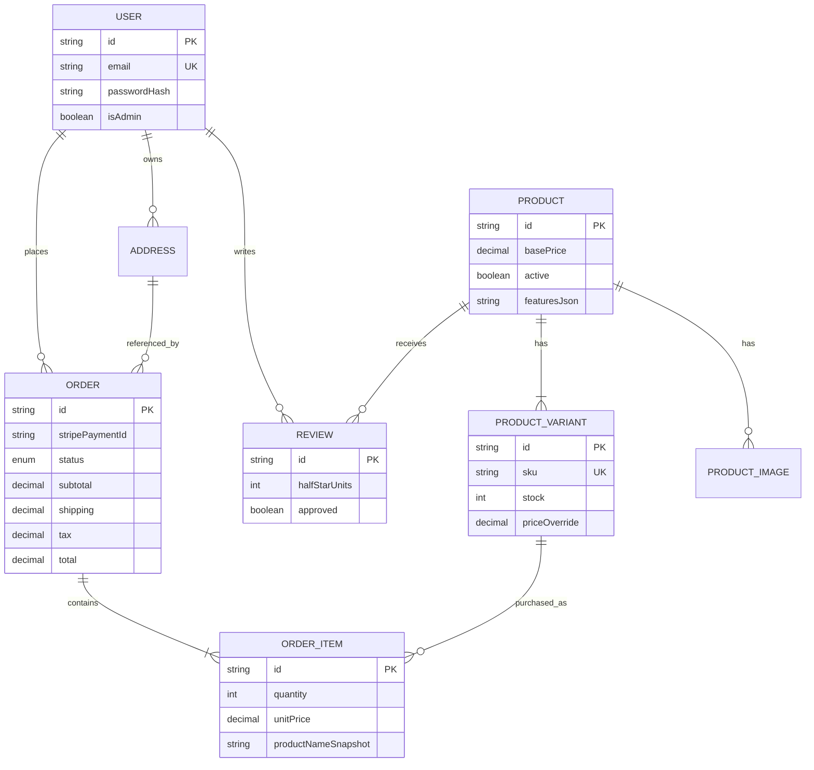
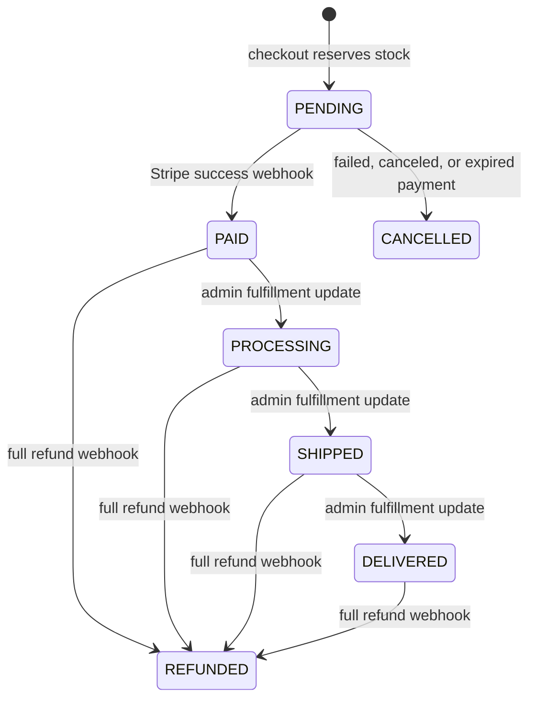

# Domain model and invariants

Last verified: July 15, 2026

## Ownership

| Data | Source of truth | Notes |
| --- | --- | --- |
| Users, products, inventory, orders, reviews | PostgreSQL | Accessed through Prisma |
| Card and payment execution | Stripe | The application stores PaymentIntent IDs and projected order status |
| Product image assets | Cloudinary | Product records store delivery URLs; Drive URLs remain for legacy images |
| Mailing-list rows | Google Sheets | Not transactionally connected to application data |
| Cart | Browser `localStorage` | Untrusted display state; validated at checkout |
| Analytics consent | Browser `localStorage` | Controls Google Analytics only |

## Entity relationships



## Product and inventory

A `Product` is the catalog identity. A `ProductVariant` is the purchasable stock unit.

Rules:

- Only active products are returned by the public catalog.
- A variant can override the product base price.
- SKU is unique when present.
- Product, size, and color are unique as a variant combination.
- Checkout requires a variant ID and validates current stock.
- Stock cannot go negative through checkout because the decrement uses `stock >= quantity` inside the order transaction.
- A product or variant referenced by an order is historical data and cannot be deleted through the admin API.
- Deactivation and stock zero are the supported retirement controls.

Known modeling gaps:

- Product features are JSON stored in a string column rather than a typed JSON field or relation.
- Category, size, and color are free-form strings.
- Stock adjustments have no ledger, reason, actor, or audit timestamp beyond the variant update time.
- Inventory reservation is represented only by decrementing stock and creating a `PENDING` order.

## Order totals

The server calculates every persisted amount:

```text
unit price = variant override or product base price
subtotal = sum(unit price * quantity)
shipping = 0 when subtotal >= 50 USD, otherwise 5.99 USD
tax = Stripe Tax result
total = subtotal + shipping + tax
```

Client totals are previews and never authorize a charge.

Amounts are stored as database decimals, but parts of the application calculate with JavaScript numbers before converting to cents for Stripe. A future commerce module should make integer cents the in-memory boundary.

## Order state



The code does not enforce this transition graph in one place. Admin users can currently set any enum value from any current status. `PAID`, `CANCELLED`, and `REFUNDED` admin changes are labels only and do not perform Stripe actions.

The target model should separate:

- payment state: pending, paid, failed, canceled, partially refunded, refunded;
- fulfillment state: unfulfilled, processing, shipped, delivered, returned;
- operational exceptions: manual review, payment mismatch, inventory reconciliation.

## Payment reconciliation

Each checkout creates one Stripe PaymentIntent and stores its ID on the order.

Current safeguards:

- Webhooks require a valid Stripe signature.
- Success updates only `PENDING` orders.
- Failure or cancellation restores stock only for a `PENDING` order.
- Repeated failure events do not restore stock twice.
- Cleanup re-reads Stripe after a failed cancellation to avoid releasing inventory for a payment that won a race.

Missing persistence constraints:

- `stripePaymentId` is not unique in the database.
- Stripe webhook event IDs are not stored.
- There is no reconciliation job comparing Stripe and order state.
- Partial refunds have no representation.

## Customer identity and addresses

Accounts are optional. Guest order contact and shipping information are snapshotted on `Order`. Signed-in orders also snapshot shipping information, which protects historical fulfillment data from later address edits.

`Address` exists in the schema but no current checkout or account flow creates or selects address records. `addressId` is effectively dormant.

Public email lookup returns order status, items, and totals for every matching order. It does not return the customer name or shipping address. Email possession is not verified, so this remains a privacy weakness even after address removal.

## Reviews

- A user can review a product once.
- Review submission requires a paid or later order containing a variant of that product.
- Ratings are stored as integer half-star units from 1 through 10.
- New reviews are private until approved by an admin.
- Public review reads return only approved reviews.

There is no moderation audit trail, rejection reason, or record of the admin actor.

## Authentication

- Email is normalized to lowercase.
- Passwords are bcrypt-hashed with cost 12.
- Password minimum length is 8.
- JWT sessions carry user ID and admin status.
- Admin status is rechecked against PostgreSQL for existing admin tokens.

Input length limits, password maximum length, account verification, password reset, and session revocation are not implemented.

## Subscriber model

The mailing list is a Google Sheet containing email and timestamp rows. Emails are normalized before duplicate comparison. The read-then-append sequence is not atomic, so concurrent requests can still create duplicates.

If subscriber data becomes operationally important, move it into PostgreSQL with a unique email constraint and export or sync to the marketing provider asynchronously.
