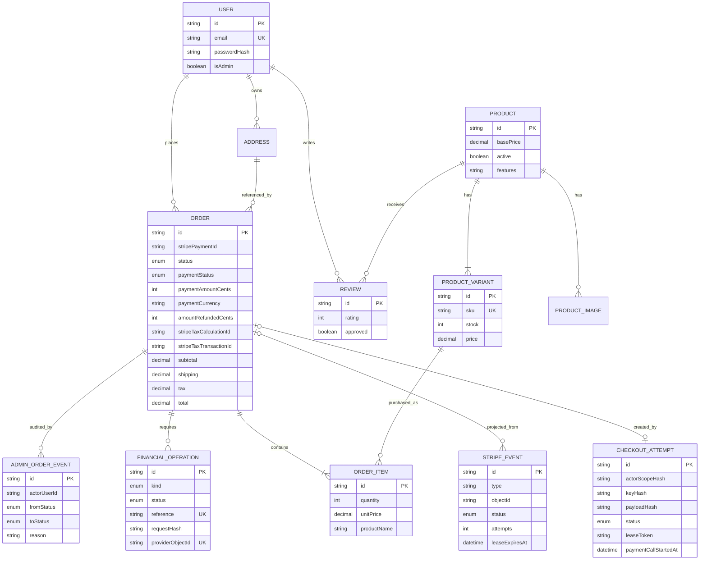
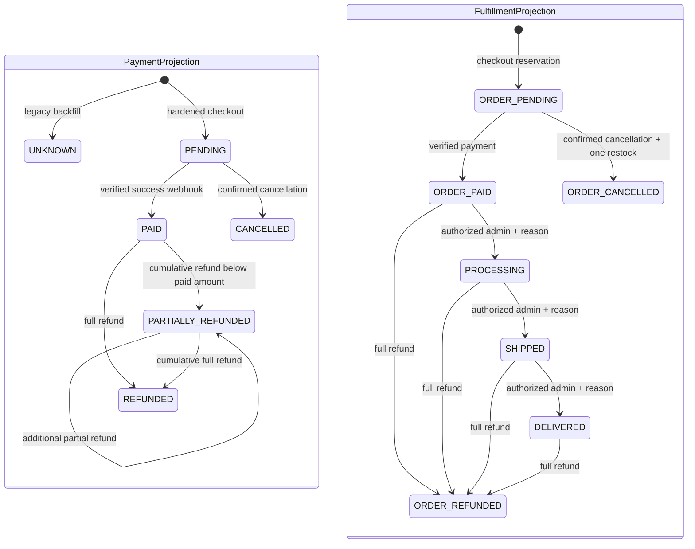
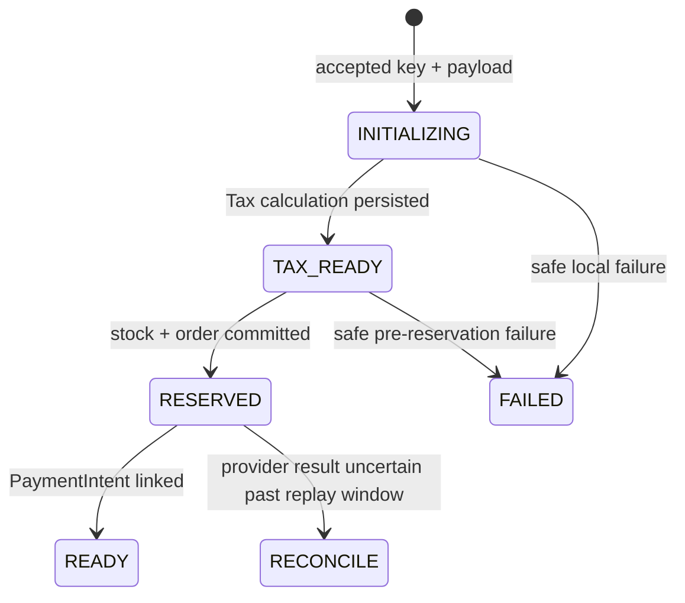

# Domain model and invariants

Last verified: September 10, 2026

This document describes the deployed payment-integrity model. Production runs main
commit `d78bcd8422d4c0a1383c2563065fe7bd8e6feb7e`; its tree matches independently
reviewed candidate `1a8bdb4095082b7c0a1f6d52707afddd9113d40c`.

## Ownership

| Data | Source of truth | Notes |
| --- | --- | --- |
| Users, products, inventory, orders, reviews | PostgreSQL | Accessed through Prisma |
| Card and payment execution | Stripe | The application stores PaymentIntent IDs and projected order status |
| Product image assets | Cloudinary | Product records store delivery URLs; Drive URLs remain for legacy images |
| Mailing-list rows | Google Sheets | Not transactionally connected to application data |
| Cart | Browser `localStorage` | Untrusted display state; validated at checkout |
| Analytics consent | Browser `localStorage` | Controls Google Analytics only |

## Entity relationships



## Product and inventory

A `Product` is the catalog identity. A `ProductVariant` is the purchasable stock unit.

Rules:

- Only active products are returned by the public catalog.
- A variant can override the product base price.
- SKU is unique when present.
- Product, size, and color are unique as a variant combination.
- Checkout requires a variant ID and validates current stock.
- Stock cannot go negative through checkout because the decrement uses `stock >= quantity` inside the order transaction.
- A product or variant referenced by an order is historical data and cannot be deleted through the admin API.
- Deactivation and stock zero are the supported retirement controls.

Known modeling gaps:

- Product features are JSON stored in a string column rather than a typed JSON field or relation.
- Category, size, and color are free-form strings.
- Stock adjustments have no ledger, reason, actor, or audit timestamp beyond the variant update time.
- Inventory adjustment outside checkout has no reason/actor ledger. Checkout reservation
  itself is linked to a durable `CheckoutAttempt`.

## Order totals

The server calculates every persisted amount:

```text
unit price = variant override or product base price
subtotal = sum(unit price * quantity)
shipping = 0 when subtotal >= 50 USD, otherwise 5.99 USD
tax = Stripe Tax result
total = subtotal + shipping + tax
```

Client totals are previews and never authorize a charge.

Amounts are stored as database decimals, but parts of the application calculate with JavaScript numbers before converting to cents for Stripe. A future commerce module should make integer cents the in-memory boundary.

## Payment and fulfillment state



The `ORDER_*` labels above are diagram aliases used to keep the two projections visually
distinct. Their persisted values are the `OrderStatus` enum names without that prefix.

The fulfillment graph is enforced in `lib/order-status.js`. Admins cannot create financial
states; verified payment is required before fulfillment, and actor/reason audit rows are
committed atomically with the transition.

The additive expand-phase model separates:

- payment projection: `UNKNOWN`, `PENDING`, `PAID`, `CANCELLED`,
  `PARTIALLY_REFUNDED`, and `REFUNDED`;
- fulfillment/order projection: `PENDING`, `PAID`, `PROCESSING`, `SHIPPED`,
  `DELIVERED`, `CANCELLED`, and `REFUNDED`;
- unresolved operational work: durable `RETRY`/`RECONCILE` states on Stripe events and
  financial operations, plus checkout-attempt reconciliation.

`CheckoutAttempt` has its own durable progression:



Leases and fencing allow an expired worker to be replaced without allowing its late
completion to overwrite the new owner. Stripe events and financial operations follow
the same `received/pending -> processing -> processed/succeeded` pattern, with retry
and reconciliation states for unresolved work.

## Payment reconciliation

Each checkout creates one Stripe PaymentIntent and stores its ID on the order.

Current safeguards:

- Webhooks require a valid Stripe signature.
- Success updates only `PENDING` orders.
- A failed payment attempt leaves the order pending so the same PaymentIntent can be retried.
- Cancellation restores stock only for a `PENDING` order.
- Repeated cancellation events do not restore stock twice.
- Cleanup re-reads Stripe after a failed cancellation to avoid releasing inventory for a payment that won a race.

Persistence constraints and durable records now include unique PaymentIntent and Tax IDs,
`StripeEvent`, `FinancialOperation`, refund cents bounded by the expected payment amount,
and `CheckoutAttempt`. `npm run reconcile:report` exposes unresolved work; scheduling and
alert routing remain deployment operations work.

## Customer identity and addresses

Accounts are optional. Guest order contact and shipping information are snapshotted on `Order`. Signed-in orders also snapshot shipping information, which protects historical fulfillment data from later address edits.

`Address` exists in the schema but no current checkout or account flow creates or selects address records. `addressId` is effectively dormant.

Anonymous email-only history is disabled. Account history is scoped by immutable user ID.
Guests receive a random single-order capability whose hash is stored server-side and whose
raw value remains in the checkout browser for at most 30 days. It cannot authorize an
account order or another guest order.

## Reviews

- A user can review a product once.
- Review submission requires a paid or later order containing a variant of that product.
- Ratings are stored as integer half-star units from 1 through 10.
- New reviews are private until approved by an admin.
- Public review reads return only approved reviews.

There is no moderation audit trail, rejection reason, or record of the admin actor.

## Authentication

- Email is normalized to lowercase.
- Passwords are bcrypt-hashed with cost 12.
- Password minimum length is 8.
- JWT sessions carry user ID and admin status.
- Admin status is rechecked against PostgreSQL for existing admin tokens.

Input length limits, password maximum length, account verification, password reset, and session revocation are not implemented.

## Subscriber model

The mailing list is a Google Sheet containing email and timestamp rows. Emails are normalized before duplicate comparison. The read-then-append sequence is not atomic, so concurrent requests can still create duplicates.

If subscriber data becomes operationally important, move it into PostgreSQL with a unique email constraint and export or sync to the marketing provider asynchronously.
