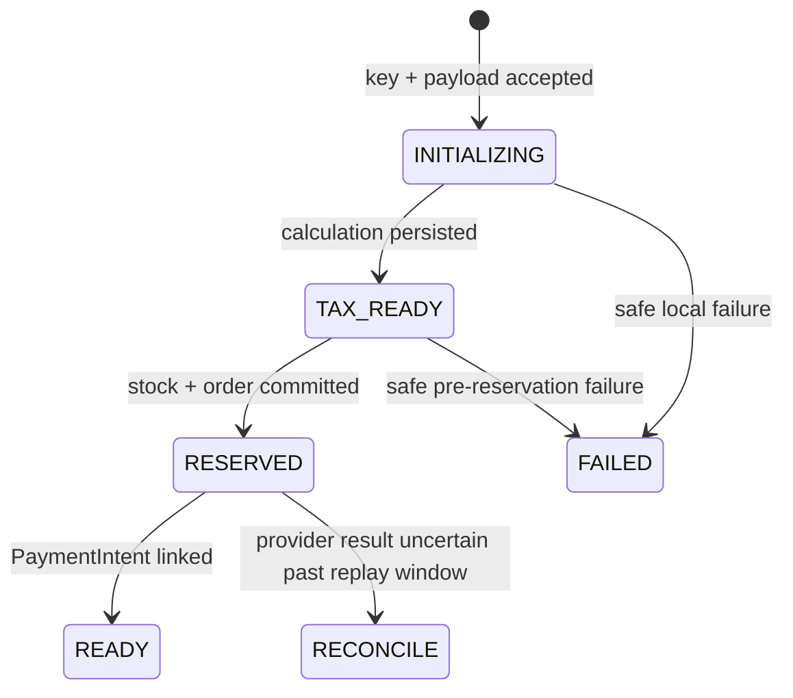

# Payment, tax, and checkout operations

Last verified: September 10, 2026

## Durable state model

Checkout uses a server-side `CheckoutAttempt` keyed by SHA-256 hashes of an
actor scope, a UUIDv4 idempotency key, and a canonical request payload. The
browser stores only the opaque key and payload hash before the request. It
keeps that key for an identical checkout across reloads until a terminal order
result retires it. The server stops automatic provider replay after 23 hours;
the browser must not rotate the key to bypass that reconciliation boundary.

The attempt moves through:



Inventory and the pending order are committed before a PaymentIntent is
created. A failed local finalization never blindly cancels a PaymentIntent; a
retry uses the same Stripe idempotency key. Cleanup does not restock an attempt
whose remote PaymentIntent result may be uncertain.

A `READY` replay re-reads its PaymentIntent. Only a provider-confirmed `canceled`
status returns `CHECKOUT_RESTART_REQUIRED`, which lets the browser retire that exact
key and create a new checkout on the user's next explicit submission. Pending,
unknown, provider-error, and reconciliation states retain the original key.

Signed Stripe events are recorded in `StripeEvent` before projection. Local
projection and ledger state share one database transaction. Duplicate and
out-of-order delivery is safe. A non-2xx response is returned while local or
financial work remains unresolved so Stripe retries instead of receiving false
success.

Tax commits and partial refund reversals are durable `FinancialOperation`
records with immutable request hashes, stable Stripe idempotency keys, leases,
and completion fencing. Stripe v1 idempotency guarantees are not assumed after
24 hours: automated provider replay stops at 23 hours and marks the operation
`RECONCILE` for human review.

This application pins Stripe API `2024-12-18.acacia`. It therefore uses the
Stripe Tax transaction APIs (`createFromCalculation` and `createReversal`), not
the PaymentIntent Tax hook introduced in `2025-11-17.clover`. Tax transaction
posting time defaults to the provider call time because `posted_at` is omitted;
reconciliation should compare that time with the payment event and operation
timestamps.

```mermaid
sequenceDiagram
    participant Stripe
    participant Webhook
    participant DB as PostgreSQL
    participant Tax as Stripe Tax

    Stripe->>Webhook: signed payment/refund event
    Webhook->>DB: insert or lease StripeEvent
    Webhook->>DB: transaction: verify + project payment state
    Webhook->>DB: enqueue immutable FinancialOperation
    Webhook->>Tax: commit/reverse with stable idempotency key
    Tax-->>Webhook: Tax Transaction or reversal ID
    Webhook->>DB: fenced operation + event completion
    Note over Webhook,DB: retry unresolved work; reconcile after safe replay window
```

Payment and refund projection never restocks physical inventory. Only a confirmed
PaymentIntent cancellation can cancel a pending order and restore its reserved stock,
once. Fulfillment remains a separate admin-authorized graph.

## Reconciliation

Run the read-only report against an authorized environment:

```text
npm run reconcile:report
```

Exit code `0` means no unresolved records. Exit code `2` means the JSON report
contains unresolved financial operations, Stripe events, or checkout attempts
older than 30 minutes. The report excludes request payloads, customer identity,
shipping data, credentials, capability keys, and Stripe client secrets.

For each unresolved item, compare the database record with the Stripe object
and delivery history before changing state. Never retry an operation marked
`RECONCILE` until the provider result is known. Prefer replaying the original
signed Stripe event after the underlying fault is fixed. Record any manual
correction as an incident action with the relevant order, event, and operation
IDs.

## Guest access

Guest checkout creates a single-order capability. Its raw value is kept in the
same browser's local storage and its hash is stored server-side. Both browser
and server enforce a 30-day lifetime. It cannot authorize an account-owned
order or disclose order history. Other-device recovery remains unavailable
until a verified transactional-email channel exists.

## Telemetry boundaries

Sentry defaults to no PII and no session replay. Request bodies, cookies,
authorization, idempotency keys, guest access keys, Stripe client secrets,
referrer URLs, and matching breadcrumb fields are removed before telemetry is
sent. Operational logs use identifiers plus bounded error codes rather than
provider or database error messages.

## External contract evidence

The September 10 candidate has comprehensive mocked and PostgreSQL-backed contract
coverage, but no real Stripe sandbox run was executed because the available account
requires Gustavo's MFA and no authorized test secret was available. Anden accepted
that limitation for review-branch publication and asked that Gustavo not be interrupted.
It is deferred evidence, not a permanent blocker or permission to use live keys.

Before a production payment release, run the prepared TEST-only procedure when normal
authorized sandbox access is available. Retain nonzero-tax commit/reversal evidence and
locally signed webhook-to-ledger evidence. Never substitute a live charge.
